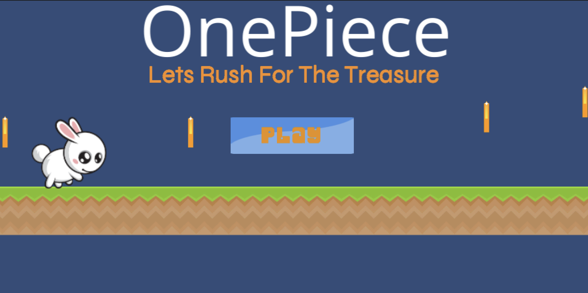
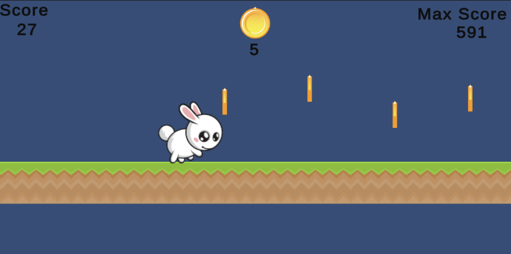
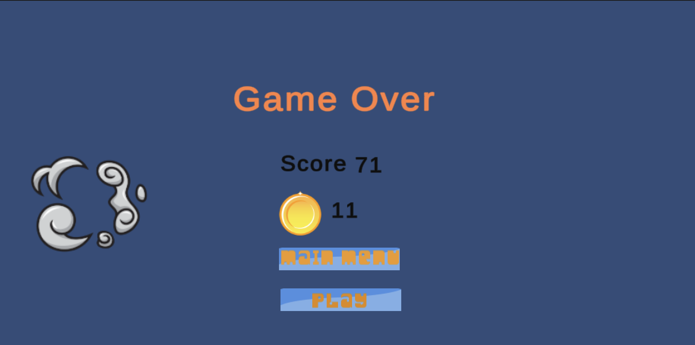

# Coin Collector Game

🌟 **Version 1** 🌟  
_The very first game proudly created by me!_

This is version 1 and the very first game made by me.

Coin Collector Game is a 2D game where players control a bunny that runs and collects coins. The game features a main menu, a game phase, and a game-over phase. It tracks the current score, max score, and total coin collection to enhance player engagement.

## Features
- **Main Menu**: Start or exit the game.
- **Game Phase**: Collect coins while running and avoid obstacles.
- **Game Over Phase**: Displays the final score, max score, and total coins collected.
- **Score Tracking**: Real-time display of the current score, max score, and total coin collection.

## Built With
- **Unity**: Game development platform (Editor version 2022.3.30f1).
- **C#**: Programming language used for game logic.
- **Apple Silicon Mac OS**: Development environment.

### Main Menu Scene


### Running Scene


### Game Over Scene


*(Replace `readme_images/` with the correct relative path if needed.)*

## How to Play
1. Launch the game.
2. Start the game from the main menu.
3. Control the bunny to collect coins and avoid obstacles.
4. Try to beat your max score and collect as many coins as possible.

## Acknowledgements
- **ChatGPT**: For providing guidance and support during development.
- **Unity Asset Store**: For providing valuable assets used in the game.
- **Udemy**: For motivation and learning resources.

## Installation
1. Clone the repository:
   ```bash
   git clone https://github.com/Foysal-Munsy/2D-coin-collection-game.git
   ```
2. Open the project in Unity Editor (version 2022.3.30f1).
3. Build and run the game on your preferred platform.

## Usage
This repository is public, and you can use it for your learning. However, **please do not sell or distribute this game commercially**. Contributions are welcome, and you can submit pull requests with your improvements.

## Contribution
Contributions are welcome! Feel free to fork the repository and submit a pull request with your improvements.

## License
This project is open source and available under the [MIT License](LICENSE).

---

Happy gaming! 🎮
